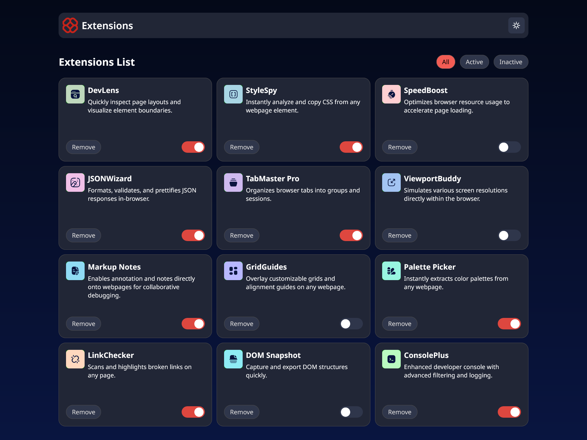

# Frontend Mentor - Browser extensions manager UI solution

This is a solution to the [Browser extensions manager UI challenge on Frontend Mentor](https://www.frontendmentor.io/challenges/browser-extension-manager-ui-yNZnOfsMAp). Frontend Mentor challenges help you improve your coding skills by building realistic projects. 

## Table of contents

- [Overview](#overview)
  - [The challenge](#the-challenge)
  - [Screenshot](#screenshot)
  - [Links](#links)
- [My process](#my-process)
  - [Built with](#built-with)
  - [What I learned](#what-i-learned)
  - [Continued development](#continued-development)
  - [Useful resources](#useful-resources)
- [Author](#author)
- [Acknowledgments](#acknowledgments)


## Overview

This was kind of a stressful challenge but i was so happy i was able to overcome it. imagine handling all this with just a single component

### The challenge

Users should be able to:

- Toggle extensions between active and inactive states
- Filter active and inactive extensions
- Remove extensions from the list
- Select their color theme
- View the optimal layout for the interface depending on their device's screen size
- See hover and focus states for all interactive elements on the page

### Screenshot



### Links

- Solution URL: [Solution URL](https://www.frontendmentor.io/challenges/browser-extension-manager-ui-yNZnOfsMAp)
- Live Site URL: [Live Site URL](https://browser-extension-psi.vercel.app/)

## My process

i started by styling my component. then i handled my state with redux and also persisted the data a little

### Built with

- Semantic HTML5 markup
- CSS custom properties
- CSS Grid
- Mobile-first workflow
- [React](https://reactjs.org/) - JS library
- [vite](https://vite.dev/) - JS library

### What I learned

i actually learnt to use px more than vh in terms of unit for height 
cause initially i used vh, on my screen everything went well but then it turn so bad on a larger one

```css
main {
  height: 180px;
}
```

### Continued development

I really want to focus on responsiveness both for lower screen and larger ones

### Useful resources

- [svg cropper](https://svg-cropper.com/) - This helped me to crop the text out of the svg. Cause the one present was for just light mode . which i will also need another one for dark


## Author

- Frontend Mentor - [@Kenzkyi](https://www.frontendmentor.io/profile/Kenzkyi)
- Twitter - [@EkeneOkoye20](https://www.twitter.com/EkeneOkoye20)


## Acknowledgments

I really want to say a very Big thank you to my friend Benjamin Jacob. he was the one that told me about the svg cropper and that was really helpful

